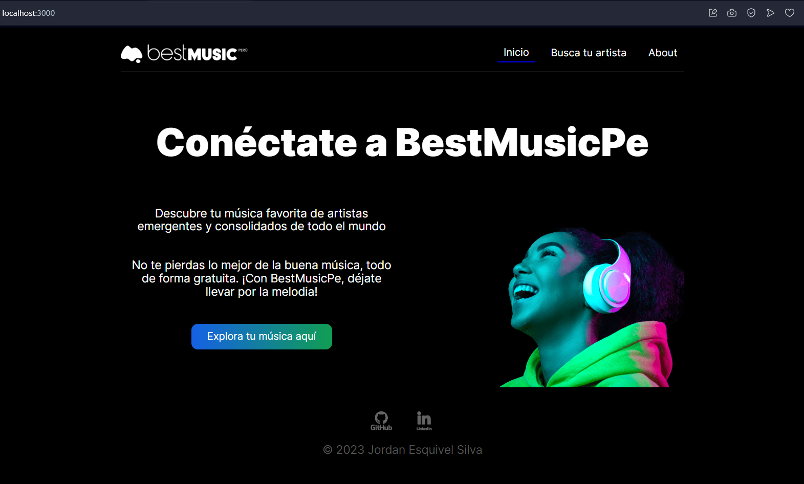

# Proyecto 17 - Best Music Pe

"Best Music Pe" es una página web desarrollada con React que utiliza la API de Spotify a través de RapidAPI para brindarte una experiencia musical excepcional.
Con esta aplicación, podrás buscar y descubrir álbumes de tus artistas favoritos de una manera sencilla y elegante. Explora la diversidad de la música y encuentra los mejores álbumes de los artistas que amas con "Best Music Pe".
¡Prepárate para sumergirte en el mundo de la música!"

## Características del proyecto:

- **Sintonizado con React**: La aplicación se construye con React para darle un toque de interactividad y suavidad.

- **Descubre tus Álbumes Favoritos**: Encuentra los álbumes de tus artistas preferidos y explora su música de manera sencilla.

- **Búsqueda Sencilla**: Utiliza la función de búsqueda para encontrar a tus artistas favoritos en un abrir y cerrar de ojos.

- **Reproducción en Spotify**: ¿Quieres escuchar un álbum en Spotify? ¡Un clic en la imagen del álbum y estarás en camino!

- **Manejo de Errores con Estilo**: Si la búsqueda no da resultados, te lo haremos saber con un amigable mensaje de error.

- **Página "Acerca de"**: En la página "Acerca de", te contamos la historia detrás del proyecto y te presentamos a Jordan Esquivel, el creador.
  
- **Gestión de Datos Eficiente**: Al realizar una búsqueda, los datos se actualizan en la variable de estado y se almacenan localmente para una experiencia fluida. Se utiliza un hook personalizado para renderizar y mantener los datos de manera eficiente.

## Pasos de instalación

Sigue estos pasos para configurar y ejecutar el proyecto en tu máquina local:

1. **Clonar el repositorio**: Comienza clonando el repositorio de GitHub en tu máquina local utilizando el siguiente comando:

   git clone https://github.com/JordanEsquivelS/BusquedaCancion-Frontend.git

2. **Instalar dependencias**: Abre una terminal en la carpeta raíz del proyecto y ejecuta el siguiente comando para instalar todas las dependencias necesarias:

   npm install

3. **Obtener claves secretas de RapidAPI**:

   Antes de comenzar, necesitas obtener las claves secretas de RapidAPI para que tu aplicación pueda acceder a la API de Spotify. Sigue estos pasos:

   - Ve al sitio web de RapidAPI. `https://rapidapi.com/Glavier/api/spotify23`
   - Regístrate o inicia sesión en tu cuenta de RapidAPI.
   - En la página de la API de Spotify, busca la sección de "Claves" o "Keys".
   - Genera un par de claves API (normalmente, una clave de acceso y una clave secreta).
   - Copia estas claves y guárdalas en un lugar seguro, ya que las necesitarás más adelante para configurar la autenticación en tu aplicación. (genera un archivo .env en la carpeta raíz del proyecto)
   - Una vez que hayas obtenido tus claves secretas de RapidAPI, estarás listo para configurar la autenticación en tu proyecto y aprovechar la API de Spotify.

4. **Ejecutar en modo de desarrollo**: Una vez que todas las dependencias estén instaladas, puedes ejecutar el proyecto en modo de desarrollo con el siguiente comando:

   npm start

¡Con estos pasos, deberías tener el proyecto funcionando en tu máquina local .

## Demostración Pagina Best Music Pe

### Página Inicial

- Ruta: `/`
- Descripción: Página de bienvenida a BestMusicPe.

  

### Buscar tu Artista

- Ruta: `/search`
- Descripción: Muestra la página con un formulario para buscar artistas.

  

### Resultados de la Búsqueda del Artista

- Ruta: `/search`
- Descripción: Muestra la página con un formulario para buscar artistas.

  

### Popup para Abrir en Spotify

- Descripción: Este popup pregunta si deseas abrir el álbum en Spotify.

  

### Tooltip de Búsqueda no Encontrada

- Descripción: Este tooltip se muestra cuando no se encuentran álbumes del artista buscado.

  

### Acerca de (About)

- Ruta: `/about`
- Descripción: En la página "Acerca de", te contamos la historia detrás del proyecto y te presentamos a Jordan Esquivel, el creador.

  

## Comentarios y Sugerencias

Agradezco cualquier comentario o sugerencia para mejorar este proyecto. Si tienes ideas o identificas algún problema, no dudes en abrir un "Issue" en este repositorio de GitHub o enviar una "Pull Request" si deseas contribuir directamente con mejoras al código. ¡Tu feedback es invaluable para el crecimiento y mejora de este proyecto!
